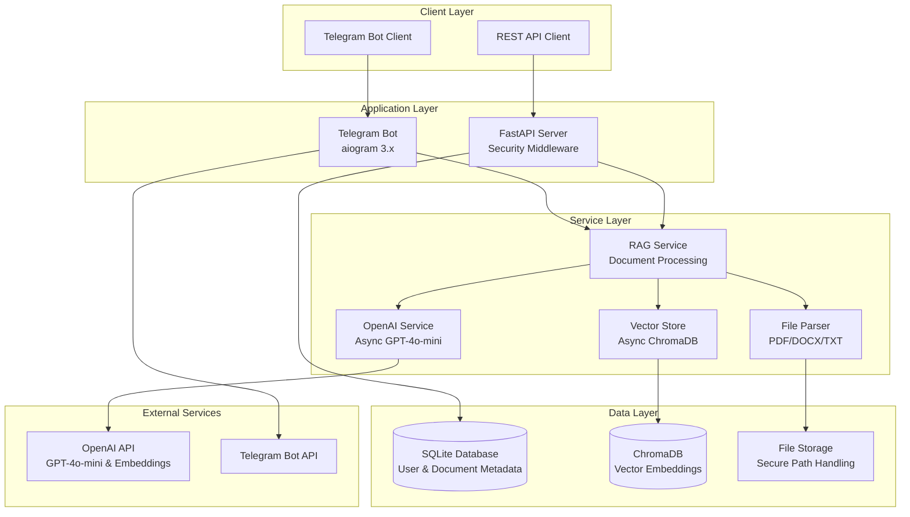

# RAG Telegram Bot

[](https://www.python.org/downloads/)
[](https://fastapi.tiangolo.com/)
[](https://opensource.org/licenses/MIT)

A production-ready Retrieval-Augmented Generation (RAG) system implemented as a Telegram bot with FastAPI backend. Supports document processing (PDF, DOCX, TXT) and contextual Q&A using OpenAI's GPT-4o-mini.

## 🏗️ Architecture



## ✨ Features

- **🔒 Security First**: Input validation, path traversal protection, XSS prevention
- **⚡ Async Architecture**: Full async/await implementation for optimal performance
- **📄 Multi-format Support**: PDF, DOCX, TXT document processing
- **🤖 Modern AI**: GPT-4o-mini with text-embedding-3-small for embeddings
- **👥 Multi-user**: Isolated data and collections per user
- **🛡️ Rate Limiting**: Configurable request limits and security middleware
- **📊 Monitoring**: Health checks, metrics, and comprehensive logging
- **🔧 Production Ready**: Error handling, retries, and graceful degradation

## 🚀 Quick Start

### Prerequisites

- Python 3.8+
- OpenAI API key
- Telegram Bot Token

### Installation

1. **Clone the repository**
   ```bash
   git clone <repository-url>
   cd RAG
   ```

2. **Create virtual environment**
   ```bash
   python -m venv venv
   source venv/bin/activate  # Linux/macOS
   # or
   venv\Scripts\activate     # Windows
   ```

3. **Install dependencies**
   ```bash
   pip install -r requirements.txt
   ```

4. **Configure environment**
   ```bash
   cp .env.example .env
   # Edit .env with your API keys
   ```

5. **Run the system**
   ```bash
   python run.py
   ```

## ⚙️ Configuration

Create a `.env` file with the following variables:

```bash
# Required
OPENAI_API_KEY=sk-your-openai-api-key
TELEGRAM_BOT_TOKEN=your-telegram-bot-token

# Optional - Advanced Configuration
OPENAI_MODEL=gpt-4o-mini
OPENAI_EMBEDDING_MODEL=text-embedding-3-small
CHUNK_SIZE=1000
CHUNK_OVERLAP=200
MAX_FILE_SIZE_MB=50
RATE_LIMIT_ENABLED=true
MAX_REQUESTS_PER_MINUTE=30

# Security
CORS_ORIGINS=["http://localhost:3000"]
SECRET_KEY=your-secret-key

# Database
DATABASE_URL=sqlite:///./data/app.db
CHROMA_DB_PATH=./data/chroma_db

# Logging
LOG_LEVEL=INFO
ENABLE_JSON_LOGS=false
```

## 🛠️ Tech Stack

| Component | Technology | Version |
|-----------|------------|---------|
| **Backend** | FastAPI | 0.110.0 |
| **Bot Framework** | aiogram | 3.5.0 |
| **AI/ML** | OpenAI API | 1.14.0 |
| **Vector DB** | ChromaDB | 0.4.24 |
| **Database** | SQLite + SQLAlchemy | 2.0.29 |
| **Text Processing** | LangChain | 0.1.13 |
| **Security** | Bleach, Cryptography | Latest |
| **Async HTTP** | httpx | 0.27.0 |

## 📡 API Endpoints

### System
- `GET /` - Service status
- `GET /health` - Health check with service status
- `GET /metrics` - Usage metrics and statistics

### Users
- `POST /users/` - Create or retrieve user

### Documents
- `POST /upload/` - Upload and process document
- `POST /query/` - Query document with RAG
- `GET /users/{user_id}/documents/` - List user documents
- `DELETE /documents/{document_id}` - Delete document

## 🧪 Testing

Run the test suite:
```bash
python test_system.py
```

For development testing:
```bash
pytest tests/ -v
python -m pytest --cov=app tests/
```

## 🔐 Security Features

- **Input Validation**: Comprehensive validation for all user inputs
- **Path Traversal Protection**: Secure file handling with path validation
- **XSS Prevention**: Text sanitization using bleach library
- **Rate Limiting**: Configurable rate limits per endpoint
- **Access Control**: User-based data isolation
- **Secure Headers**: Security middleware for HTTP headers
- **File Type Validation**: MIME type checking and content validation

## 📊 Monitoring & Logging

The system includes comprehensive monitoring:

- **Health Checks**: Multi-service health monitoring
- **Metrics**: User, document, and message statistics
- **Structured Logging**: JSON logging support with correlation IDs
- **Error Tracking**: Detailed error logging with context
- **Performance Metrics**: Response times and processing statistics

## 🏗️ Development

### Project Structure
```
RAG/
├── app/
│   ├── config.py              # Configuration management
│   ├── main.py               # FastAPI application
│   ├── database/             # Database models & connection
│   ├── services/             # Business logic
│   │   ├── rag_service.py    # RAG orchestration
│   │   ├── openai_service.py # OpenAI API integration
│   │   ├── vector_store.py   # ChromaDB operations
│   │   └── file_parser.py    # Document parsing
│   ├── telegram/             # Telegram bot
│   └── utils/               # Utilities & helpers
├── data/                    # Data storage
├── logs/                    # Application logs
└── requirements.txt         # Dependencies
```

### Code Quality

The project follows:
- **PEP 8** style guidelines
- **Type hints** for better code documentation
- **Async/await** patterns throughout
- **Error handling** with custom exceptions
- **Security best practices**
- **Comprehensive logging**

### Contributing

1. Fork the repository
2. Create a feature branch
3. Make your changes
4. Add tests
5. Submit a pull request

## 📝 Usage Examples

### Telegram Bot Commands

- `/start` - Initialize bot and get welcome message
- `/help` - Show help and usage instructions
- `/documents` - List your uploaded documents
- `/clear` - Clear chat history

### Document Processing Flow

1. **Upload**: Send a document file to the bot
2. **Processing**: System parses, chunks, and indexes the content
3. **Query**: Ask questions about the document content
4. **Response**: Get contextual answers based on document content

### Sample Queries

- "What is the main topic of this document?"
- "Summarize the key findings"
- "Find information about [specific topic]"
- "What does the document say about [question]?"

## 🚀 Deployment

### Docker (Recommended)

```dockerfile
FROM python:3.11-slim
WORKDIR /app
COPY requirements.txt .
RUN pip install -r requirements.txt
COPY . .
CMD ["python", "run.py"]
```

### Production Considerations

- Use environment variables for secrets
- Set up proper logging aggregation
- Configure reverse proxy (nginx)
- Enable HTTPS
- Set up monitoring and alerting
- Regular database backups

## 📄 License

This project is licensed under the MIT License - see the [LICENSE](LICENSE) file for details.

## 🤝 Support

- **Issues**: GitHub Issues for bug reports
- **Documentation**: Check the `/docs` endpoint when running in debug mode
- **API Reference**: Available at `/redoc` when running in debug mode

## 🔄 Version History

- **v1.0.0**: Initial release with core RAG functionality
- Enhanced security and async architecture
- Production-ready monitoring and logging 